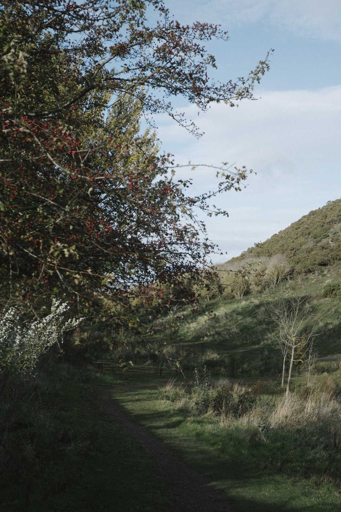
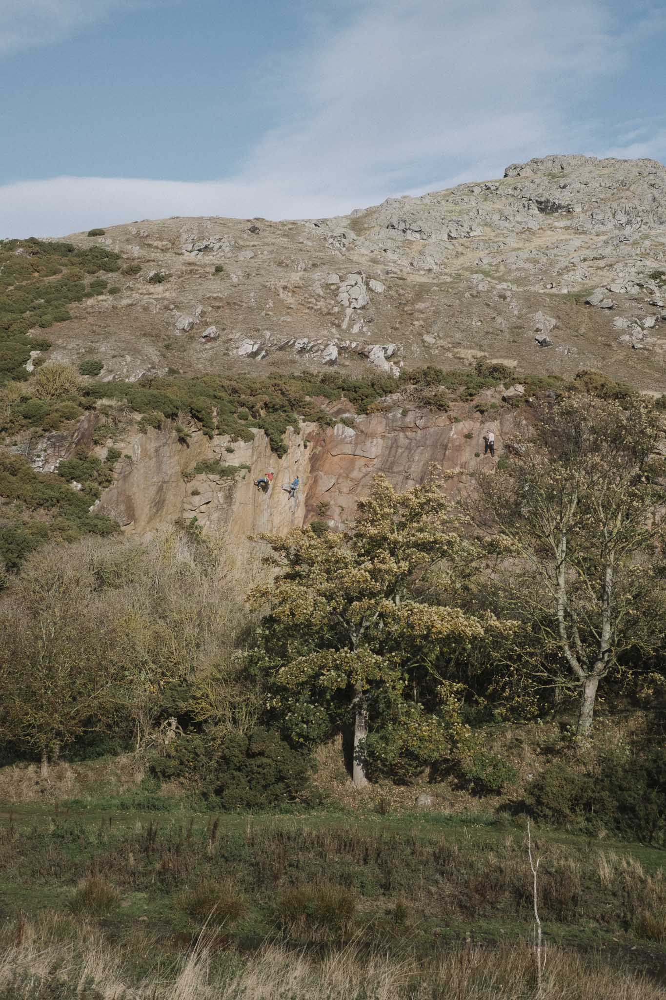
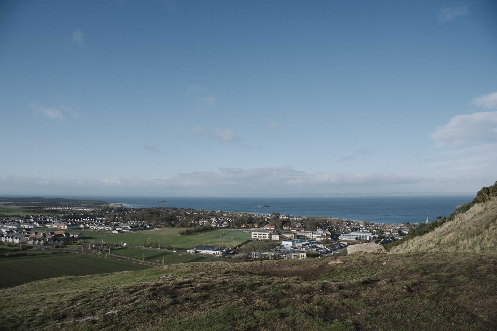
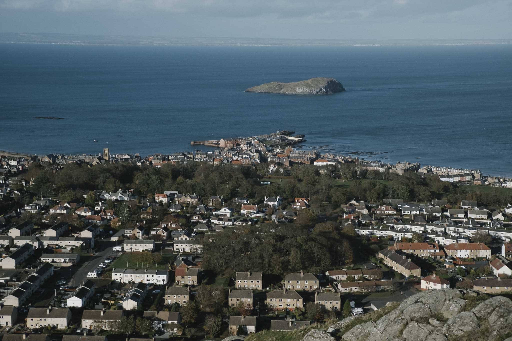
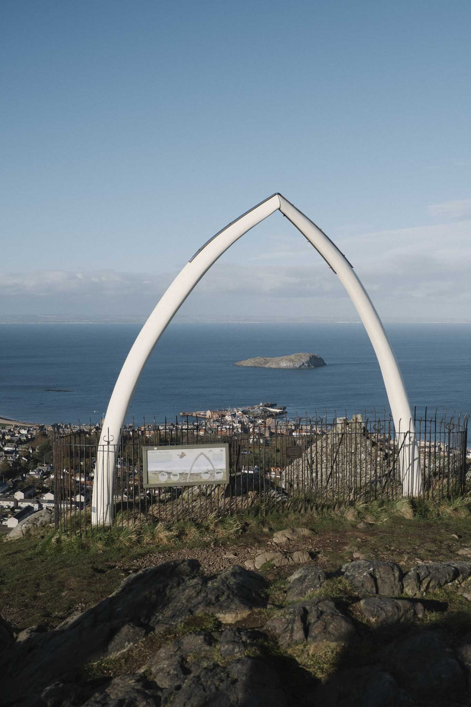

# North Berwick Law

## Details

| Field | Value |
|-------|-------|
| **Coordinates** | 56.048825, -2.713749 |
| **Elevation** | 187 m |
| **Summit feature** | Trig point, view indicator, whale jawbones |
| **Class list** | Marilyn, Hump, Tump (100-199m), Yeaman |
| **Date of ascent** | 2-NOV-2025 |

## Description

North Berwick Law is a distinctive volcanic cone located at the mouth of the Firth of Forth. The prominent summit is visible for miles around and offers spectacular views across the Firth of Forth and the surrounding landscape. The walk is straightforward and suitable for all abilities.

## Route

The main path climbs steadily from the car park near the town centre. The final approach to the summit involves a few steps but the views from the top are outstanding, including views to the Bass Rock, Tantallon Castle, and on clear days, the Forth Bridges.

## How to Reach

### Car Parking

[North Berwick Law car park](https://maps.app.goo.gl/65doBqmz5VsTZChS6)

### Public Transport

Buses and trains to North Berwick

## Photos

